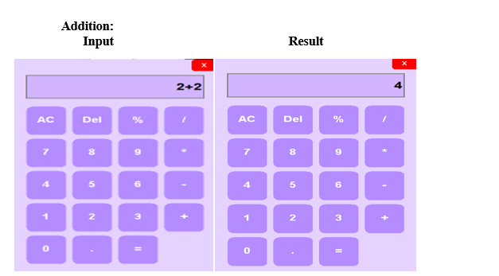
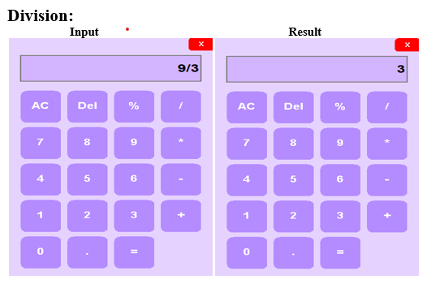
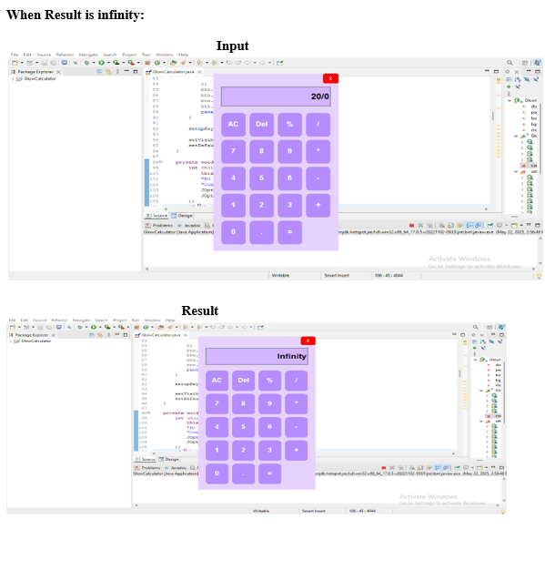
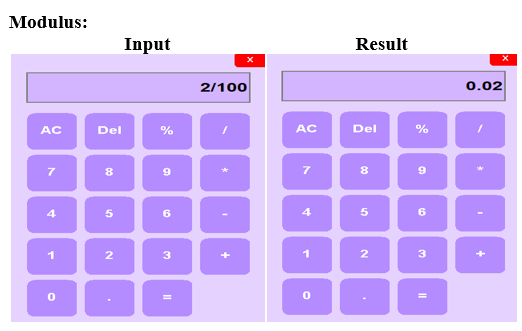
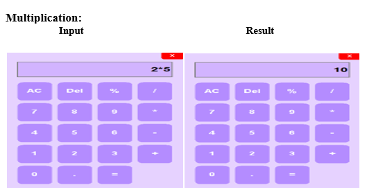
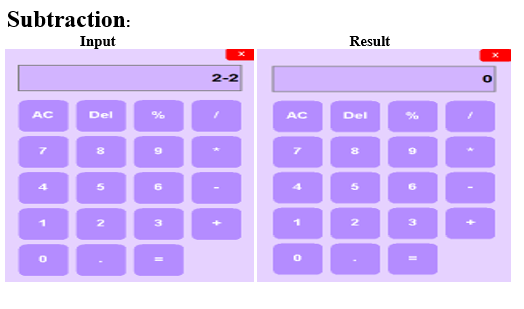
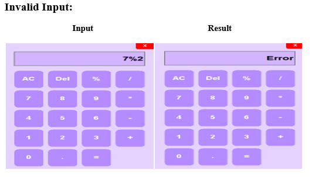

# 🧮 Glow Calculator


A modern desktop calculator built using Java Swing with interactive UI, hover effects, and error handling.

---

# ✨ Features

- ➕ Addition
- ➖ Subtraction
- ✖️ Multiplication
- ➗ Division
- 🧮 Modulus operation
- ⚠️ Invalid input handling
- ♾️ Infinity/Divide-by-zero handling
- 🎨 Modern glow-inspired UI

---

# 📸 Screenshots

## ➕ Addition


---

## ➗ Division


---

## ♾️ Infinity Error Handling


---

## 🧮 Modulus


---

## ✖️ Multiplication


---

## ➖ Subtraction


---

## ⚠️ Invalid Input


---

# 🚀 How to Run

## Run using JAR file

Download:

```bash
dist/GlowCalculator.jar
```

Run:

```bash
java -jar GlowCalculator.jar
```

---

# 🛠️ Tech Stack

- Java
- Java Swing

---

# 📂 Project Structure

```bash
glow-calculator/
│
├── dist/
├── screenshots/
├── src/
├── .gitignore
├── README.md
```

---

# 🎯 Learning Outcomes

- GUI development using Java Swing
- Event-driven programming
- Error handling
- Java desktop application structure

---

# 🔮 Future Improvements

- Scientific calculator functions
- Keyboard support
- Dark mode
- Calculation history

---

# 👨‍💻 Author

**Vikas Kumar**

📧 vikas.kumarrr2002@gmail.com

🔗 LinkedIn:
https://www.linkedin.com/in/vikaskumar-web
